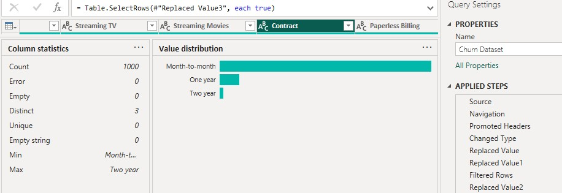
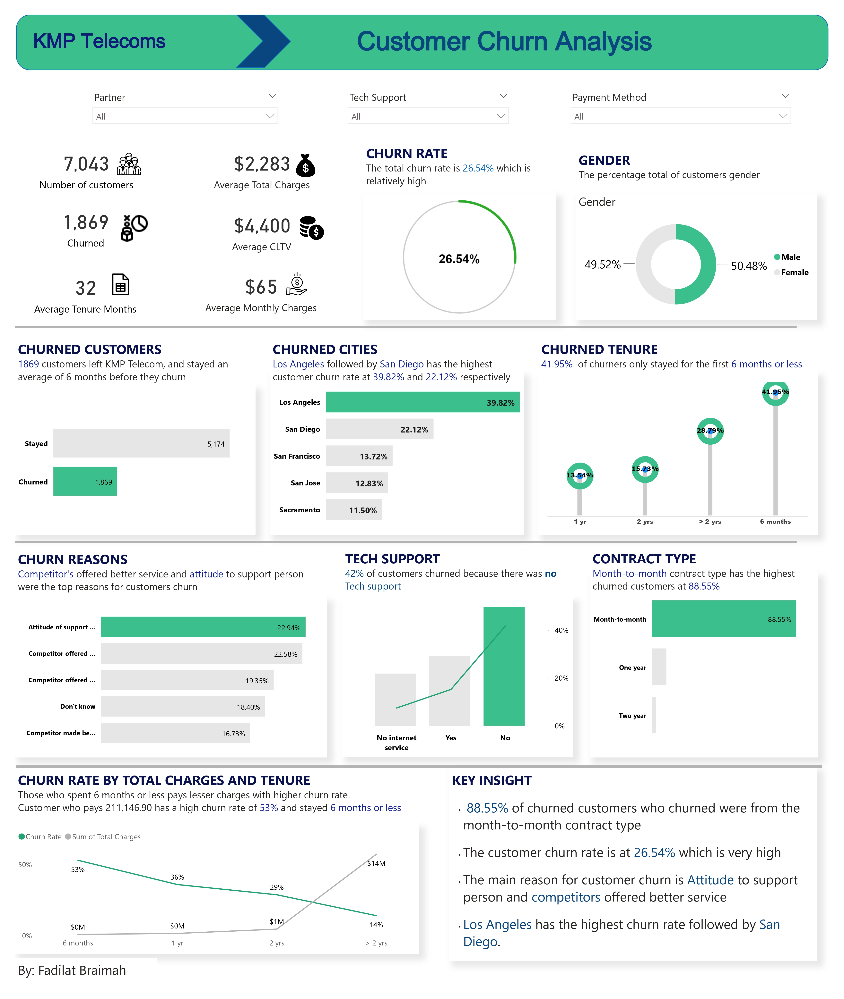
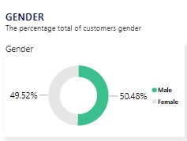
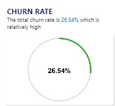
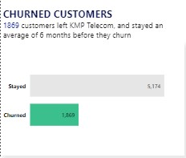
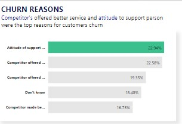
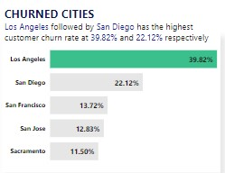
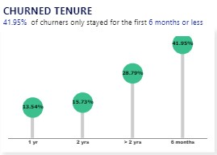
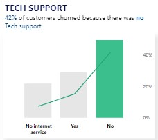
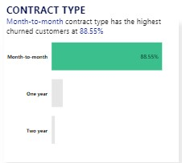

# Customer Churn: Churn Rate Analysis

## What is customer churn?
Customer churn (or customer attrition) refers to the loss of customers or subscribers for any reason at all.
**Customer Churn Rate** in its broadest sense, is a measure of the number of individuals or items moving out of a collective group over a specific period. It is one of two primary factors that determine the steady-state level of customers a business will support.

## Data Analysis Process
A series of steps must be carried out in order to interpret this information. Finding these procedures is crucial because each step is important in ensuring that the data is processed correctly in order to provide relevant and useful information. The steps I did in this process are listed below.:

- Introduction
- Power BI concept applied
- Problem Statement
- Data Cleaning Process
- Data Visualization
- Communications and Insights

## Introduction
I came across this dataset online and i admired how rich the dataset looks and i decided to make more sense to this dataset.
The main aim of this project is to help KPM Telecom answer or reveals patterns that indicate common motivators for customers to leave, such as price sensitivity or poor product adoption. It also demonstrates how customers engage with your product throughout its lifecycle. find dataset [here](https://www.kaggle.com/datasets/yeanzc/telco-customer-churn-ibm-dataset)

### Power BI concept applied are:
- Dax concepts
- Calculated Columns

## Problem Statement

Churn analysis helps you identify pain points throughout the entire customer journey. Understanding those pain points then opens up avenues to improve your products, services, and communication. This analysis will focus on:
- Analyzing the rate at which customer leave the company
- Investigate the impact of customer churn in the telecom industry as a whole.
- To know Which customers are leaving
- To know why they are leaving
- To know Which group of customers have the highest churn rate?

## Data Cleaning Process
This dataset was effiently cleaned and transformed with Power Query Editor of Power BI. The dateaset which contain 7043 observations(rows) with 33 variables(columns) where trimmed, cleaned, changed datatype, replaced unwanted values, remove duplicates and made first row as header. 

## Data Visualization
For visualisation, I exported my final csv file to Power BI and I created a dashboard to better display my findings and communicate the analysis.

## Communication and Insights
### Gender
Is there gender gap? could that be a reason for customers leaving?
The percentage of gender is relatively very close which means there was no gender gap. KMP Telecom has 50.48% male and 49.2% female customers.

### Churn Rate
From my analysis, 26.54% of customers churned for different reasons :astonished: . That is not looking good as this is a high churn rate for KMP Telecom. Why are my customers leaving? :cry: lets no why?

### Chuned Customers
Out of 7,043 customers, 1,869 churned and 5,174 stayed. A high percentage of churners stayed at least six(6) months or less befor leaving. This is a short period of time compare to the effort it takes to onboard a customer.

### Churn Reasons
There are alot of noted reasons customers decides to leave the company, the top 5 reasons are **Attidude to support person, competitors offers higher download speeds, competitors offered more data, don't know and competitors made better offers**. With **Attitude to support person at 22.94%** churn rate.
All these reasons are valid and KMP Telecom needs to upgrade their internet speed, good customer care orientation and give out offers to customers who have stayed for a period of time to aviod increase in customer churn rate.

### Churned Cities
Analysing the top 5 cities with the highest churn rate, **Los Angeles** took the lead to be the city with the highest churn rate with **39.82%** churn rate :flushed: followed by **San Diego** and **San Francisco** with **22.12%**  and **13.72%** churn rate respectively. Dont leave us we will try to make things right :blush: 

### Churned Tenure

A higher pecentage of churners churned the first 6 months after joining KMP Telecom. **41.95%** of customers churned after staying for 6 months or less followed by the group of customers who have stayed more than 2 years which has a churn rate of **28.79%**

### Tech Support

Analysis have shown that a large number of customers left because there was **No Tech Support* offered. **3,473** customers left KMP Telecom because there was **No Tech Support** which is **42%** churn rate, **2,044** customers left even when Tech support was provided which is **15%** churn rate and **1,526** customers left because there was **No service** which is **7%** churn rate.

### Contract Type
It obvious customers leave easily in the month-to-month contract type, **88.55%** of the churned customers are from the month-to-month contract type. If customers are not satisfied with the service provided on the first few months, they might likely leave.

### Insight!!
- 88.55% of churned customers who churned were from the month-to-month contract type
- The customer churn rate is at 26.54% which is very high
- The main reason for customer churn is Attitude to support person and competitors offered higher download speed, KMP should invest more on customer service orientation and upgrade their internet speed.
- Los Angeles has the highest churn rate followed by San Diego.
- The month-to-month contract type should be reviewed

**__Interact with__** [Dashbord](https://app.powerbi.com/groups/me/reports/92c8784d-41c1-4c66-aaf5-65a5563b0eda/ReportSection)

By: Braimah Fadilat.
